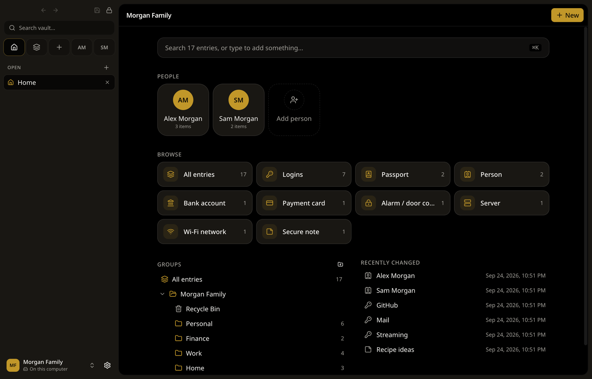
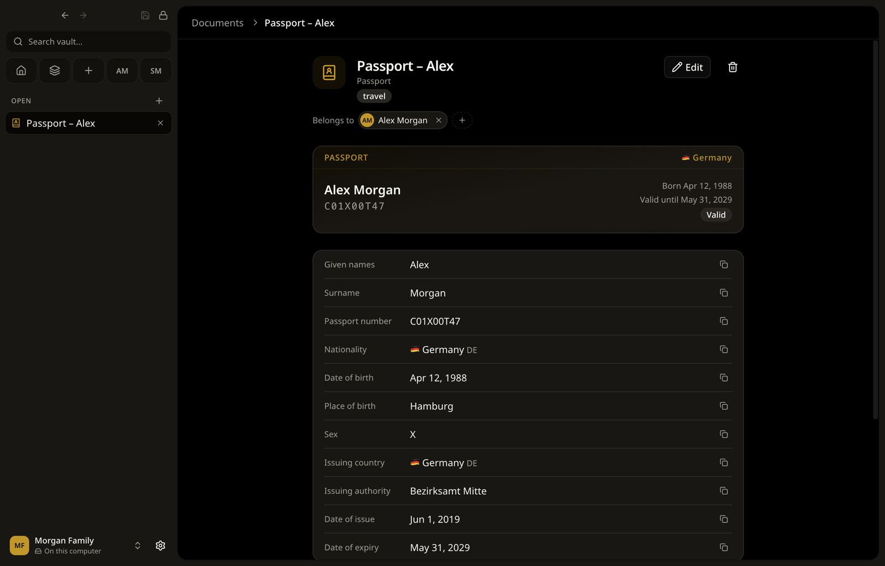
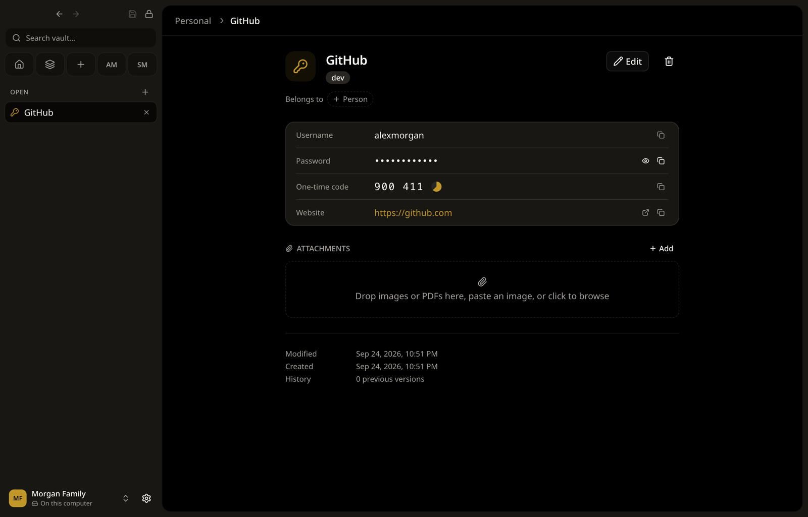
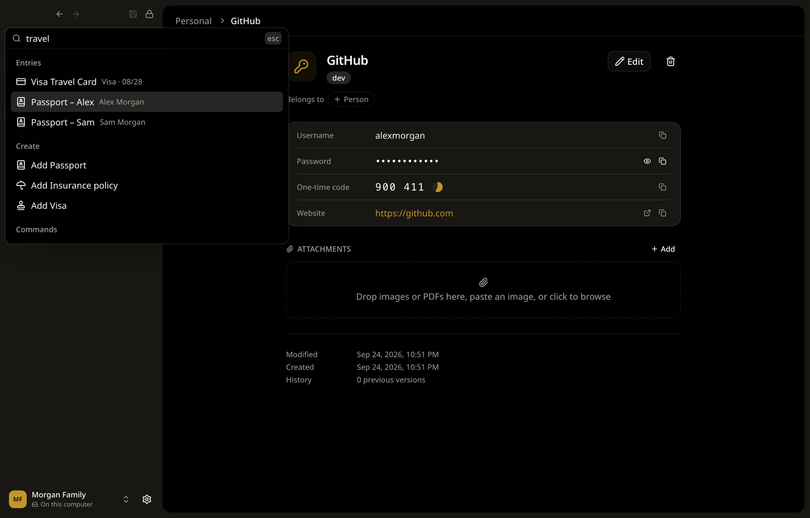
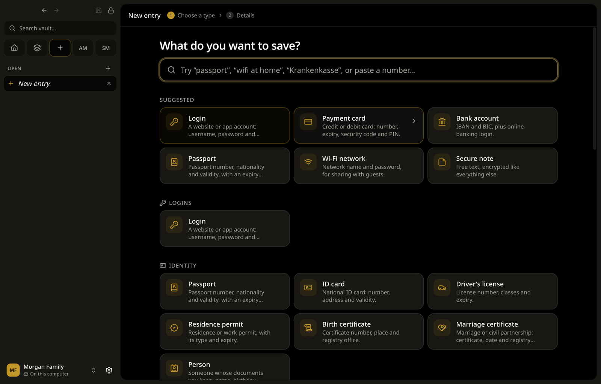

# Sekure

A desktop app for your **KeePass (`.kdbx`) vaults**: local files, Touch ID unlock, and
typed entries for the documents in your life.

**[Download the latest release](https://github.com/arkitektio/sekure/releases/latest)**

| Platform              | Installer                             |
| --------------------- | ------------------------------------- |
| macOS (Apple silicon) | `sekure-<version>.dmg`                |
| Windows               | `sekure-<version>-setup.exe`          |
| Linux                 | `sekure-<version>.AppImage` or `.deb` |

Sekure updates itself when a new version is out.

## Features

- **Works with KeePass.** Reads and writes KDBX 3 and 4, compatible with KeePassXC,
  KeePass, Strongbox and KeeWeb.
- **Local files, no accounts.** Put the vault in a synced folder (iCloud, Dropbox, Google
  Drive) to use it on several devices.
- **Conflict-safe saves.** If the file changed elsewhere, both versions are merged instead
  of overwritten.
- **Typed entries.** Passports, ID cards, bank accounts, payment cards, Wi-Fi, servers and
  more, stored as plain KeePass fields.
- **People.** Link entries to family members and browse everything that belongs to them.
- **Touch ID.** Unlock with your fingerprint. The vault auto-locks after inactivity
  (5 minutes by default), on sleep and on screen lock.
- **Search.** ⌘K finds entries, and optionally uses an on-device model to find them by meaning.
- **Auto-type.** Press ⌘⌥⇧K in any app to paste a password, username or one-time code.
- **TOTP codes, password generator, attachments** (images and PDFs), and a clipboard that
  clears itself after 30 s.

|                                                  |                                                         |
| ------------------------------------------------ | ------------------------------------------------------- |
|  |  |
|            |             |

_All data shown is made up._

## Security

- Secrets stay in the main process; the sandboxed UI only sees titles and metadata.
- The vault is decrypted in memory only.
- Touch ID releases a master password sealed in the macOS Keychain.
- macOS builds are signed and notarized, and all builds are locked down with Electron fuses.

## License

[MIT](LICENSE.md)
